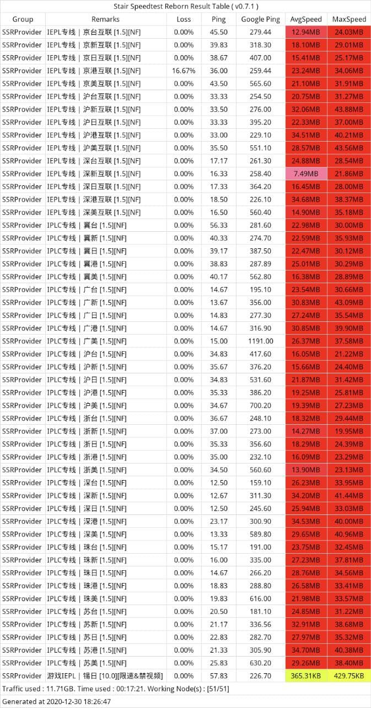

        

老牌 技术流 奈飞机场（广义VPN/翻墙梯子）“Mielink”:        

[注册链接](http://mielink-invite.com/register?aff=qinqin)        

* 有回国/出国/企业团队定制，三种套餐，Trojan协议为主，首批升级Trojan覆盖的机场之一，专线用SSR协议，V3解锁IPLC专线，V4解锁IEPL专线。               
* 解锁各地区奈飞等流媒体，顶级套餐长期赠送奈飞HBO等共享账号。      
* 提前跑完套餐高速流量则进入低速不限量模式安心不怕失联，大流量用户推荐使用0倍率的标注无限流量的节点。     
* 注册时输入邀请码qinqin可以获得10元余额红包。     
* 支付接入日本区国际支付，老板是日本国籍人在日本，网站由TrojanQT5团队核心成员自写维护。稳如老狗。       
* 注册就送三天5GB v2等级线路体验。      
* 每个人网络状况不一样，建议先月付v3等套餐一个月先体验下，满意再续费。    
* 即使满意，也建议保持月付任何一家机场的习惯，确保不会遇到无良跑路商家。            
* 2020.12.30 Mielink v3/v4等级节点测速图（为了保证全体用户的体验不被个别用户极限占用所破坏，故有限速）:                      
  

[如果有VPS需求点击这里](../MyFanFan.md)      

[回到主页面](../README.md)               
